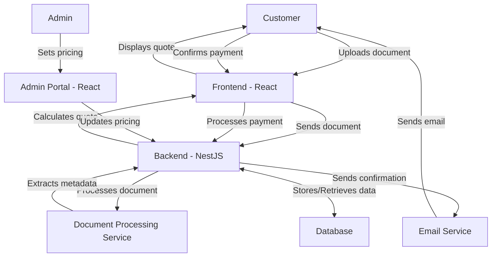

<h2>Printing Job project</h2>

### Get the application started

<span>Application is divided into two parts:</span>

<ul>
<li>Frontend application: Developed with React JS, MUI</li>
<li>Backend  application: Developed with Nest JS, Mongo DB</li>
</ul>

### Starting the application

---

<h6>To start the Frontend application</h6>

<span>cd to ./frontend and run </span>

only run this for first time installation

```sh
    npm install
```

To start the application

```sh
    npm run dev
```

<b>The application would start on port 5173</b>

---

<h6>To start the Backend application</h6>

<span>cd to ./backend and run </span>

only run this for first time installation

```sh
    npm install
```

To start the application

```sh
    npm run start:dev
```

<b>The application would start on port 4000</b>

<br/>
<br/>

### Project approach

---

The development approach was the develop and design a robust printing quotation application which relies on validating any document uploaded to the system and a price is given based on certain conditions

To achieve something like this, Javascript frameworks are adopted based on speed of javascript language and using MongoDB for my database which is a noSQL Database and are known for excellent latency in query time.

Different endpoints are created from the backend for the functional operation of the frontend application.

### Development Trade off

---

During the development of this system. Extracting images pixels from uploaded document seems ambiguous and not easily achievable due to time constraint. The best approach at the moment was to give out a mock up value for the image properties such as height, width and pixel count.

### Print Job Management System Architecture

---



### Deployment

---

Application fully deployed to server

- Backend url: https://printing-job-backend.onrender.com/docs
- Frontend url: https://printing-job-frontend.onrender.com

<b>Note: Due to free tier deployment, file storage is not available, however using Cloudinary for file upload seems to be breaking the application, so it advisable to test the application locally</b>

### Application Frontend Routes

---

- / :-> loads the application customer page
- /admin :-> loads the admin page

### Local deployment

- http://localhost:5173/ :-> loads the application customer page
- http://localhost:5173/admin :-> loads the admin page

### Production deployment

- https://printing-job-frontend.onrender.com/ :-> loads the application customer page
- https://printing-job-frontend.onrender.com/admin :-> loads the admin page
